# UFW-Firewall-Configuration
- if UFW already installed jump to [Content](https://github.com/thechiragvaishnav-dotcom/UFW-Firewall-Configuration/blob/main/README.md#content)
- open your linux terminal
  
- Check whether UFW is already install or not
  - <code>sudo ufw status</code>

  
- If you see command not found
  - <code>sudo apt install ufw</code>

  

## Content
- [Step 1 — Making Sure IPv6 is Enabled](https://github.com/thechiragvaishnav-dotcom/UFW-Firewall-Configuration/blob/main/README.md#step-1--making-sure-ipv6-is-enabled)
- [Step 2 — Setting Up Default Policies](https://github.com/thechiragvaishnav-dotcom/UFW-Firewall-Configuration/blob/main/README.md#step-2--setting-up-default-policies)
- [Step 3 — Allowing SSH Connections](https://github.com/thechiragvaishnav-dotcom/UFW-Firewall-Configuration/blob/main/README.md#step-3--allowing-ssh-connections)
- [Step 4 — Enabling UFW](https://github.com/thechiragvaishnav-dotcom/UFW-Firewall-Configuration/blob/main/README.md#step-4--enabling-ufw)
- [Step 5 — Allowing Other Connections](https://github.com/thechiragvaishnav-dotcom/UFW-Firewall-Configuration/blob/main/README.md#step-5--allowing-other-connections)
- [Step 6 — Denying Connections](https://github.com/thechiragvaishnav-dotcom/UFW-Firewall-Configuration/blob/main/README.md#step-6--denying-connections)
- [Step 7 — Deleting Rules](https://github.com/thechiragvaishnav-dotcom/UFW-Firewall-Configuration/blob/main/README.md#step-7--deleting-rules)
- [Step 8 — Checking UFW Status and Rules](https://github.com/thechiragvaishnav-dotcom/UFW-Firewall-Configuration/blob/main/README.md#step-8--checking-ufw-status-and-rules)
- [Step 9 — Disable or Reset Firewall](https://github.com/thechiragvaishnav-dotcom/UFW-Firewall-Configuration/blob/main/README.md#step-9--disable-or-reset-firewall)
- [Security Best Practices for Firewall Management](https://github.com/thechiragvaishnav-dotcom/UFW-Firewall-Configuration/blob/main/README.md#security-best-practices-for-firewall-management)

## Step 1 — Making Sure IPv6 is Enabled
In recent versions of Ubuntu, IPv6 is enabled by default. In practice that means most firewall rules added to the server will include both an IPv4 and an IPv6 version, the latter identified by <code>v6</code> within the output of UFW’s status command. To make sure IPv6 is enabled, you can check your UFW configuration file at <code>/etc/default/ufw</code>. Open this file using <code>nano</code> or your favorite command line editor:
- <code>sudo nano /etc/default/ufw</code> and press <code>Enter</code>

  
- Then make sure the value of <code>IPV6</code> is set to <code>yes</code>. It should look like this:

  
  - Save and close the file. If you’re using <code>nano</code>, you can do that by typing <code>CTRL+X</code>, then <code>Y</code> and <code>ENTER</code> to confirm.
  - When UFW is enabled in a later step of this guide, it will be configured to write both IPv4 and IPv6 firewall rules.

## [Back to Content](https://github.com/thechiragvaishnav-dotcom/UFW-Firewall-Configuration/blob/main/README.md#content)

## Step 2 — Setting Up Default Policies
If you’re just getting started with UFW, a good first step is to check your default firewall policies. These rules control how to handle traffic that does not explicitly match any other rules.

By default, UFW is set to deny all incoming connections and allow all outgoing connections. This means anyone trying to reach your server would not be able to connect, while any application within the server would be able to reach the outside world. You can then create specific <code>allow</code> rules as exceptions to this <code>deny</code> policy.

To make sure you’ll be able to follow along with the rest of this tutorial, you’ll now set up your UFW default policies for incoming and outgoing traffic.

To set the default UFW incoming policy to <code>deny</code>, run:
- <code>sudo ufw default deny incoming</code>

  

To set the default UFW outgoing policy to allow, run:
- <code>sudo ufw default allow outgoing</code>

  

These commands set the defaults to deny incoming and allow outgoing connections. These firewall defaults alone might suffice for a personal computer, but servers typically
need to respond to incoming requests from outside users. We’ll look into that next.

## [Back to Content](https://github.com/thechiragvaishnav-dotcom/UFW-Firewall-Configuration/blob/main/README.md#content)

## Step 3 — Allowing SSH Connections
If you were to enable your UFW firewall now, it would deny all incoming connections. This means that you’ll need to create rules that explicitly allow legitimate incoming connections — SSH or HTTP connections, for example — if you want your server to respond to those types of requests. If you’re using a cloud server, you will probably want to allow incoming SSH connections so you can connect to and manage your server.

1. Allowing the OpenSSH UFW Application Profile\
Upon installation, most applications that rely on network connections will register an application profile within UFW, which enables users to quickly allow or deny external  access to a service. You can check which profiles are currently registered in UFW with:\
<code>sudo ufw app list</code>\
\
\
To enable the OpenSSH application profile, run:\
<code>sudo ufw allow OpenSSH</code>\
\
\
This will create firewall rules to allow all connections on port 22, which is the port that the SSH daemon listens on by default.

2. Allowing SSH by Service Name\
Another way to configure UFW to allow incoming SSH connections is by referencing its service name: <code>ssh</code>.\
<code>sudo ufw allow ssh</code>\
\
\
UFW knows which ports and protocols a service uses based on the <code>/etc/services</code> file.

3. Allowing SSH by Port Number\
Alternatively, you can write the equivalent rule by specifying the port instead of the application profile or service name. For example, this command works the same as the previous examples:\
<code>sudo ufw allow 22</code>\
\
\
If you configured your SSH daemon to use a different port, you will have to specify the appropriate port. For example, if your SSH server is listening on port <code>2222</code>, you can use this command to allow connections on that port:\
<code>sudo ufw allow 2222</code>\
\
\
Now that your firewall is configured to allow incoming SSH connections, you can enable it.

### Rate Limiting

To protect services like SSH from automated brute-force attacks, UFW includes a rate-limiting feature. When you apply a rate limit to a service, UFW tracks the frequency of connection attempts from each source IP address. If an IP address makes too many connections in a short period, UFW will temporarily block it. This is a more intelligent approach than simply allowing or denying traffic, as it distinguishes between normal use and behavior that is likely malicious.

To enable rate limiting for a service, you use the <code>limit</code> command instead of <code>allow</code>. The most common use case is securing SSH.
- <code>sudo ufw limit ssh</code>

  

This single command creates a rule that allows SSH connections, but with a condition: if an IP address attempts to initiate six or more connections within 30 seconds, UFW will deny further connections from that IP. It’s a simple and effective way to add an extra layer of security to services exposed to the internet.

## [Back to Content](https://github.com/thechiragvaishnav-dotcom/UFW-Firewall-Configuration/blob/main/README.md#content)

## Step 4 — Enabling UFW
Your firewall should now be configured to allow SSH connections. To verify which rules were added so far, even when the firewall is still disabled, you can use:
- <code>sudo ufw show added</code>

  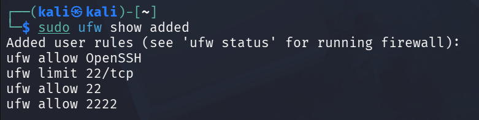
  - [what's the difference between this four RULES ?](Avoiding-Overlapping-Rules.md)

After confirming that you have a rule to allow incoming SSH connections, you can enable the firewall with:
- <code>sudo ufw enable</code>

  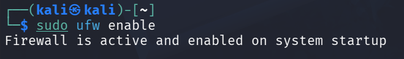

You will receive a warning that says the command may disrupt existing SSH connections. You already set up a firewall rule that allows SSH connections, so it should be fine to continue. Respond to the prompt with <code>y</code> and hit <code>ENTER</code>.

The firewall is now active. Run the command to see the rules that are set.
- <code>sudo ufw status verbose</code>

  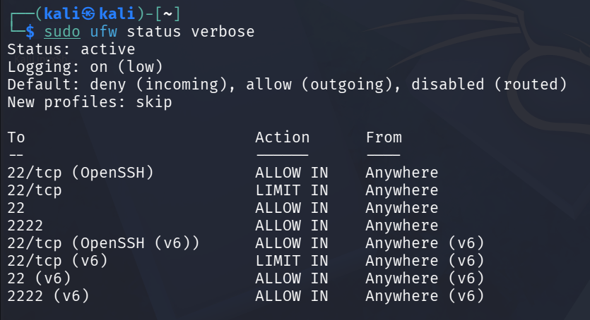

The rest of this tutorial covers how to use UFW in more detail, like allowing or denying different kinds of connections.

## [Back to Content](https://github.com/thechiragvaishnav-dotcom/UFW-Firewall-Configuration/blob/main/README.md#content)

## Step 5 — Allowing Other Connections
At this point, you should allow all of the other connections that your server needs to respond to. The connections that you should allow depend on your specific needs. You already know how to write rules that allow connections based on an application profile, a service name, or a port; you already did this for SSH on port <code>22</code>. You can also do this for:
- HTTP on port 80, which is what unencrypted web servers use, using
    - <code>sudo ufw allow http</code>
    - <code>sudo ufw allow 80</code>
- HTTPS on port 443, which is what encrypted web servers use, using
    - <code>sudo ufw allow https</code>
    - <code>sudo ufw allow 443</code>
- Apache with both HTTP and HTTPS, using
    - <code>sudo ufw allow ‘Apache Full’</code>
- Nginx with both HTTP and HTTPS, using
    - <code>sudo ufw allow ‘Nginx Full’</code>

Don’t forget to check which application profiles are available for your server with <code>sudo ufw app list</code>.

There are several other ways to allow connections, aside from specifying a port or known service name. We’ll see some of these next.

### Specific Port Ranges
You can specify port ranges with UFW. Some applications use multiple ports, instead of a single port.

For example, to allow X11 connections, which use ports 6000-6007, use these commands:
- <code>sudo ufw allow 6000:6007/tcp</code>

  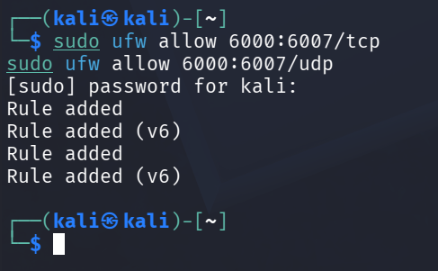
  
- <code>sudo ufw allow 6000:6007/udp</code>

  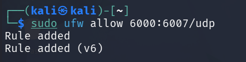
  
- When specifying port ranges with UFW, you must specify the protocol (<code>tcp</code> or <code>udp</code>) that the rules should apply to. We haven’t mentioned this before because not specifying the protocol automatically allows both protocols, which is OK in most cases.

### Specific IP Addresses
When working with UFW, you can also specify IP addresses within your rules. For example, if you want to allow connections from a specific IP address, such as a work or home IP address of <code>203.0.113.4</code>, you need to use the <code>from</code> parameter, providing then the IP address you want to allow:
- <code>sudo ufw allow from 203.0.113.4</code>

  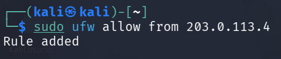

You can also specify a port that the IP address is allowed to connect to by adding <code>to any port</code> followed by the port number. For example, If you want to allow <code>203.0.113.4</code> to connect to port <code>22</code> (SSH), use this command:
- <code>sudo ufw allow from 203.0.113.4 to any port 22</code>

  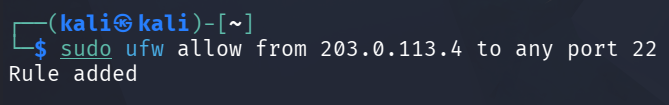

### Subnets
If you want to allow a subnet of IP addresses, you can do so using [CIDR notation](https://en.wikipedia.org/wiki/Classless_Inter-Domain_Routing#:~:text=CIDR%20notation%20is%20a%20compact,bits%20in%20the%20network%20mask.) to specify a netmask. For example, if you want to allow all of the IP addresses ranging from <code>203.0.113.1</code> to <code>203.0.113.254</code> you could use this command:
- <code>sudo ufw allow from 203.0.113.0/24</code>

  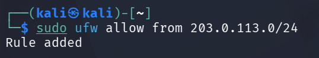

Likewise, you may also specify the destination port that the subnet <code>203.0.113.0/24</code> is allowed to connect to. Again, we’ll use port <code>22</code> (SSH) as an example:
- <code>sudo ufw allow from 203.0.113.0/24 to any port 22</code>

  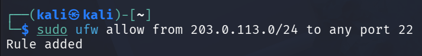

### Connections to a Specific Network Interface
If you want to create a firewall rule that only applies to a specific network interface, you can do so by specifying “allow in on” followed by the name of the network interface.

You may want to look up your network interfaces before continuing. To do so, use this command:
- <code>ip addr</code>

  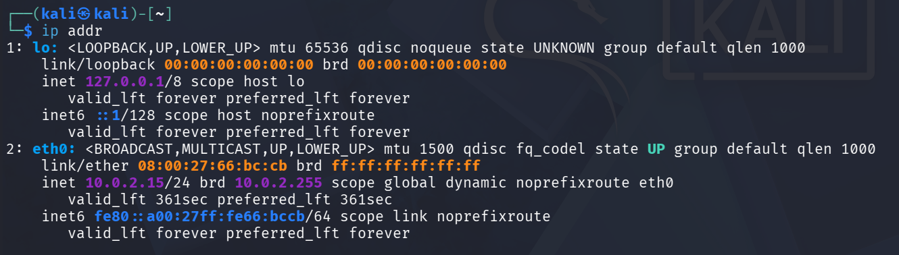

he highlighted output indicates the network interface names. They are typically named something like <code>eth0</code> or <cdoe>enp3s2</code>.

So, if your server has a public network interface called <code>eth0</code>, you could allow HTTP traffic (port <code>80</code>) to it with this command:
- <code>sudo ufw allow in on eth0 to any port 80</code>

  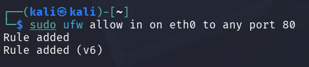

Doing so would allow your server to receive HTTP requests from the public internet.

Or, if you want your [MySQL](https://www.digitalocean.com/community/tutorials/how-to-install-mysql-on-ubuntu-20-04) database server (port <code>3306</code>) to listen for connections on the private network interface <code>eth1</code>, for example, you could use this command:
- <code>sudo ufw allow in on eth1 to any port 3306</code>

  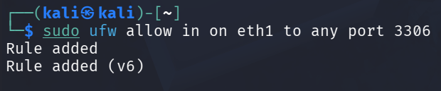

This would allow other servers on your private network to connect to your MySQL database.

## [Back to Content](https://github.com/thechiragvaishnav-dotcom/UFW-Firewall-Configuration/blob/main/README.md#content)

## Step 6 — Denying Connections
If you haven’t changed the default policy for incoming connections, UFW is configured to deny all incoming connections. Generally, this simplifies the process of creating a secure firewall policy by requiring you to create rules that explicitly allow specific ports and IP addresses through.

However, sometimes you will want to deny specific connections based on the source IP address or subnet, perhaps because you know that your server is being attacked from there. Also, if you want to change your default incoming policy to **allow** (which is not recommended), you would need to create **deny** rules for any services or IP addresses that you don’t want to allow connections for.

To write deny rules, you can use the commands previously described, replacing **allow** with **deny**.

For example, to deny HTTP connections, you could use this command:
- <code>sudo ufw deny http</code>

  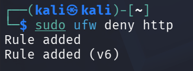

Or if you want to deny all connections from <code>203.0.113.4</code> you could use this command:
- <code>sudo ufw deny from 203.0.113.4</code>

  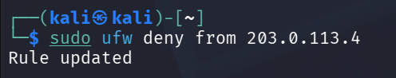

In some cases, you may also want to block outgoing connections from the server. To deny all users from using a port on the server, such as port <code>25</code> for SMTP traffic, you can use <code>deny out</code> followed by the port number:
- <code>sudo ufw deny out 25</code>

  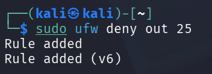

This will block all outgoing SMTP traffic on the server.

## [Back to Content](https://github.com/thechiragvaishnav-dotcom/UFW-Firewall-Configuration/blob/main/README.md#content)

## Step 7 — Deleting Rules
Knowing how to delete firewall rules is just as important as knowing how to create them. There are two different ways to specify which rules to delete: by rule number or by its human-readable denomination (similar to how the rules were specified when they were created).

### Deleting a UFW Rule By Number
To delete a UFW rule by its number, first you’ll want to obtain a numbered list of all your firewall rules. The UFW status command has an option to display numbers next to each rule, as demonstrated here:
- <code>sudo ufw status numbered</code>

  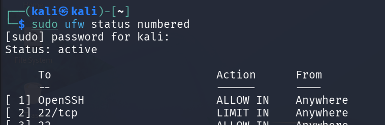

If you decide that you want to delete rule number 2, the one that allows port 80 (HTTP) connections, you can specify it in a UFW delete command like this:
- <code>sudo ufw delete 2</code>

  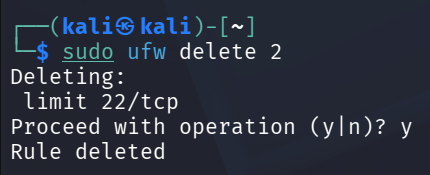

This will prompt for a confirmation then delete rule 2, which allows HTTP connections.

> **Important:** Using <code>ufw status numbered</code> lists IPv4 and IPv6 rules separately. Deleting a rule by its number will only remove that single entry. You must identify and delete the corresponding (<code>v6</code>) rule separately. In contrast, deleting a rule by name (e.g., <code>sudo ufw delete allow http</code>) removes both IPv4 and IPv6 rules automatically.

### Deleting a UFW Rule By Name
Instead of using rule numbers, you may also refer to a rule by its human-readable denomination, which is based on the type of rule (typically <code>allow</code> or <code>deny</code>) and the service name or port number that was the target for this rule, or the application profile name in case that was used. For example, if you want to delete an <code>allow</code> rule for an application profile called <code>Apache Full</code> that was previously enabled, you can use:
- <code>sudo ufw delete allow "Apache Full"</code>

  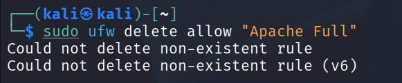

The <code>delete</code> command works the same way for rules that were created referencing a service by its name or port. For example, if you previously set a rule to allow HTTP connections with <code>sudo ufw allow http</code>, this is how you could delete said rule:
- <code>sudo ufw delete allow http</code>

  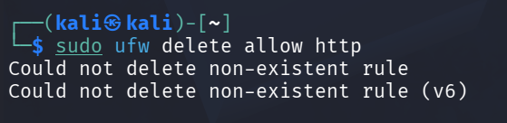

Because service names are interchangeable with port numbers when specifying rules, you could also refer to the same rule as <code>allow 80</code>, instead of <code>allow http</code>:
- <code>sudo ufw delete allow 80</code>

  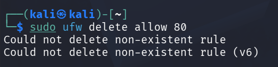

When deleting UFW rules by name, both IPv4 and IPv6 rules are deleted if they exist.

## [Back to Content](https://github.com/thechiragvaishnav-dotcom/UFW-Firewall-Configuration/blob/main/README.md#content)

## Step 8 — Checking UFW Status and Rules
At any time, you can check the status of UFW with this command:
- <code>sudo ufw status verbose</code>
  - If UFW is disabled, which it is by default, you’ll see something like this:\
    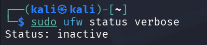
  - If UFW is active, which it should be if you followed Step 3, the output will say that it’s active and it will list any rules that are set. For example, if the firewall is set to allow SSH (port <code>22</code>) connections from anywhere, the output might look something like this:\
    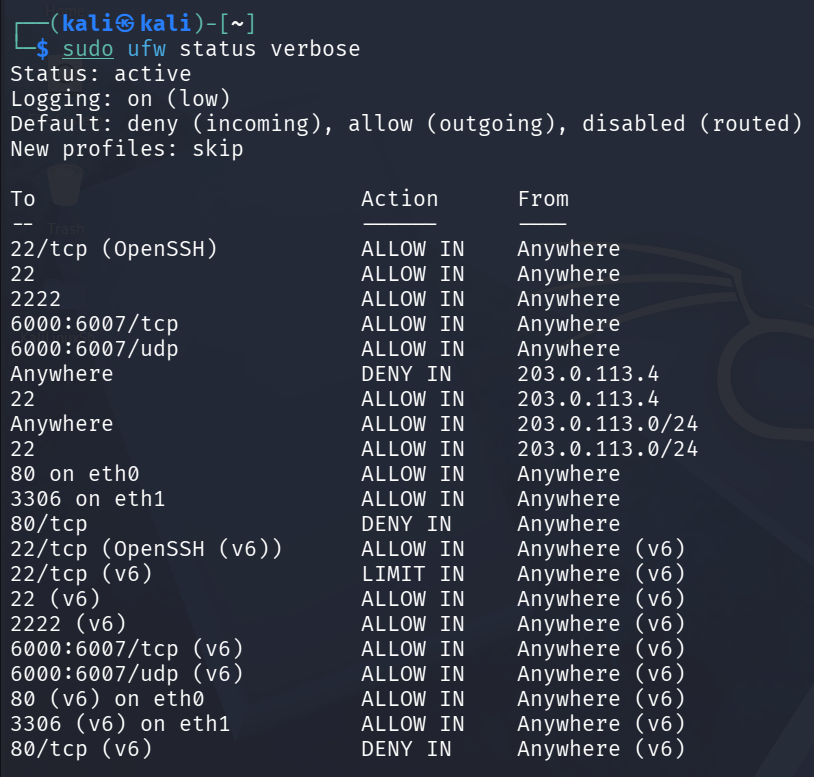

Use the <code>status</code> command if you want to check how UFW has configured the firewall.

## [Back to Content](https://github.com/thechiragvaishnav-dotcom/UFW-Firewall-Configuration/blob/main/README.md#content)

## Step 9 — Disable or Reset Firewall
If you decide you don’t want to use the UFW firewall, you can deactivate it with this command:
- <code>sudo ufw disable</code>

  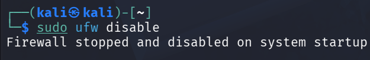

Any rules that you created with UFW will no longer be active. You can always run <code>sudo ufw enable</code> if you need to activate it later.

If you already have UFW rules configured but you decide that you want to start over, you can use the <code>reset</code> command:
- <code>sudo ufw reset</code>

  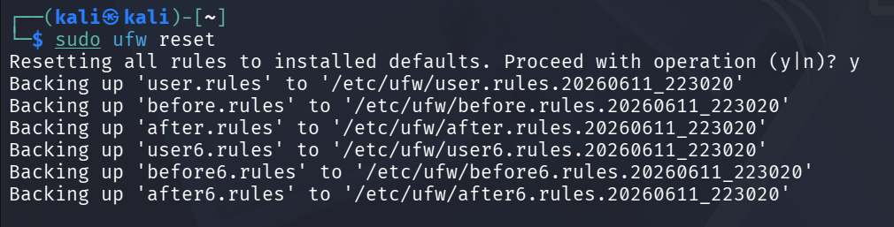

This will disable UFW and delete any rules that were previously defined. This should give you a fresh start with UFW. Keep in mind that the default policies will remain as last set; you may need to reset them manually.

> Deploy your frontend applications from GitHub using [DigitalOcean App Platform](https://www.digitalocean.com/products/app-platform). Let DigitalOcean focus on scaling your app.

## [Back to Content](https://github.com/thechiragvaishnav-dotcom/UFW-Firewall-Configuration/blob/main/README.md#content)

## Security Best Practices for Firewall Management
Configuring your firewall is the first step toward securing your server. However, maintaining that security requires ongoing attention and adherence to established best practices. A firewall is not a “set it and forget it” tool. Proper management ensures it remains an effective defense against unauthorized access.

### Apply the Principle of Least Privilege
The most fundamental concept in firewall security is the [principle of least privilege](https://www.cyberark.com/what-is/least-privilege/). This principle dictates that you should only grant the minimum level of access necessary for a service to function and deny all other connections by default.

UFW is designed around this concept. Its default policy for incoming traffic is <code>deny</code>, which is the correct starting point. Every <code>allow</code> rule you add should be a deliberate decision to open a specific path for legitimate traffic.

#### Practical Application:
- **Be Specific:** Instead of opening a wide range of ports, only open the exact ports your applications require. For a standard web server, this would be <code>sudo ufw allow http</code> and <code>sudo ufw allow https</code>.
- **Limit by Source:** If a service should only be accessible from a specific location, restrict the rule to that source IP address. For example, to allow access to a [MySQL](https://www.digitalocean.com/community/tutorials/create-insert-table-mysql) database on port <code>3306</code> only from your application server at <code>203.0.113.100</code>:
  - <code>sudo ufw allow from 203.0.113.100 to any port 3306</code>

    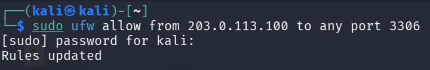

### Regularly Audit Your Firewall Rules
Server requirements change over time. Services are added, removed, or reconfigured. A firewall rule that was necessary six months ago might now be an unnecessary security risk. It is important to audit your firewall rules periodically.

#### Practical Steps for Auditing:
1. **List Your Rules:** Set a recurring reminder (e.g., quarterly) to review your configuration. Use the <code>numbered</code> status to get a clear, ordered list.
   - <code>sudo ufw status numbered</code>

     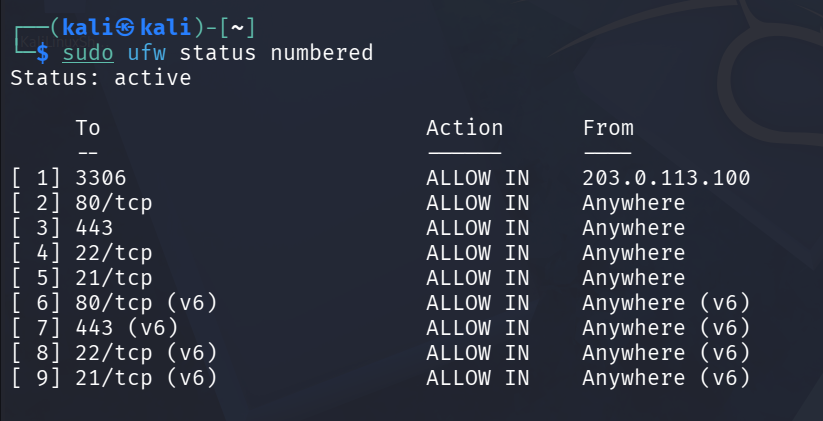
2. **Evaluate Each Rule:** For every rule in the list, ask the following questions:
   - Is the service associated with this port still running and in use?
   - Is the level of access (e.g., from <code>Anywhere</code> vs. a specific IP) still appropriate?
   - Could this rule be made more restrictive without breaking functionality?
3. **Remove Unnecessary Rules:** If a rule is no longer needed, delete it. For instance, if you no longer need FTP access, which was rule number <code>[5]</code> in your list:
   - <code>sudo ufw delete 5</code>

    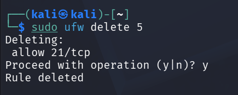

### Enable and Monitor UFW Logs
A firewall’s logs provide valuable information about the traffic reaching your server, including malicious attempts that were blocked. Without monitoring these logs, you are missing a critical source of security intelligence.

You can enable logging with a simple command:
- <code>sudo ufw logging on</code>

  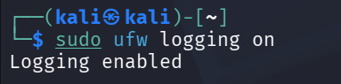

By default, UFW logs are written to <code>/var/log/ufw.log</code>. A log entry for a blocked packet contains key information you can use to identify patterns.

| Field	| Description	| Example |
| :---: | :---: | :---: |
| <code>UFW BLOCK</code>	| The action taken by UFW.	| <code>UFW BLOCK</code> |
| <code>SRC=</code> | The **source IP address** where the packet originated.	| <code>203.0.113.10</code> |
| <code>DST=</code> |	The **destination IP address** (your server).	| <code>your_server_ip</code> |
| <code>PROTO=</code>	| The network protocol used.	| <code>TCP</code> |
| <code>DPT=</code> |	The **destination port** the packet was trying to reach.	| <code>22</code> |

Regularly check these logs for suspicious activity, such as a single IP address repeatedly attempting to connect to many different blocked ports, which indicates a port scan.

### Integrate with an Intrusion Prevention System
While UFW is excellent for enforcing a static ruleset, it does not dynamically react to active threats. For automated, responsive protection, you should integrate UFW with an [Intrusion Prevention System (IPS)](https://www.geeksforgeeks.org/ethical-hacking/intrusion-prevention-system-ips/) like [Fail2ban](https://www.digitalocean.com/community/tutorials/how-fail2ban-works-to-protect-services-on-a-linux-server).

Fail2ban monitors log files for patterns of malicious behavior, such as repeated failed login attempts, and automatically creates temporary firewall rules to block the offending IP addresses. When configured to work with UFW, Fail2ban will use UFW commands to block attackers, creating a powerful, automated defense system. This combination allows UFW to handle the baseline security policy while Fail2ban deals with active threats in real time.

### Pay Attention to Both IPv4 and IPv6
A common oversight is configuring firewall rules for IPv4 traffic while forgetting about IPv6. Modern Ubuntu distributions enable IPv6 by default, and if your server has an IPv6 address, it could represent an unsecured attack surface if your firewall rules do not account for it.

By default, UFW is configured to apply rules to both IPv4 and IPv6. You can verify this by checking the main configuration file:
- <code>sudo grep "IPV6" /etc/default/ufw</code>

  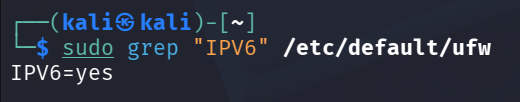

When you add a rule like <code>sudo ufw allow http</code>, UFW creates a rule for both protocols. You can see this in the status output:

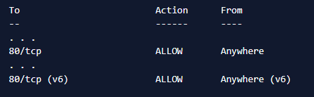

#### Best Practice:
- **Be Explicit:** Always verify that your rules are applied to both protocols. When auditing your ruleset, look for the <code>(v6)</code> entries to ensure there is parity.
- **Disable if Unused:** If your server or network does not use IPv6, the most secure approach is to disable it entirely at the kernel level. This eliminates it as a potential vector. If you only want to disable it for UFW, you can set <code>IPV6=no</code> in <code>/etc/default/ufw</code>.

### Restrict Outgoing Traffic
By default, UFW allows all outgoing traffic from your server. This is a permissive stance that is convenient but not maximally secure. For servers in high-security environments, a stricter policy is to deny all outgoing traffic by default and only allow the specific connections your server needs to initiate.

This approach can prevent a compromised server from communicating with an attacker’s command-and-control server, exfiltrating data, or being used to attack other systems.

**Practical Application:** This is an advanced technique and requires careful planning to avoid breaking essential services like DNS resolution or package updates.
1. **Change the Default Outgoing Policy:**
   - <code>sudo ufw default deny outgoing</code>

     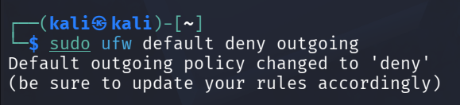
2. **Allow Essential Outgoing Connections:** You must then explicitly allow traffic for services the server depends on.
   - Allow DNS queries
     - <code>sudo ufw allow out 53</code>

       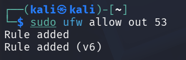

  - Allow access to package repositories and web APIs
    - <code>sudo ufw allow out to any port 80 proto tcp
sudo ufw allow out to any port 443 proto tcp</code>

      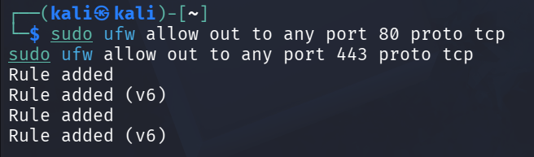
  - Allow NTP for time synchronization
    - <code>sudo ufw allow out 123/udp</code>

      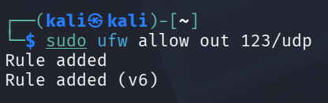

You must tailor these rules to the specific needs of your server’s applications.

### Test Rules Before and After Applying
Applying an incorrect firewall rule can cause a service outage or lock you out of your server. It is a best practice to test your ruleset before putting it into production and to verify it afterward.

#### Practical Steps for Testing:
- **Use a Staging Environment:** Whenever possible, test complex rule changes on a non-production server that mirrors your production environment.
- **Perform a Dry Run:** UFW has a <code>--dry-run</code> option that shows you what changes would be made without actually applying them. This is a safe way to check for syntax errors and see how your command will alter the ruleset.
  - <code>sudo ufw --dry-run enable</code>

    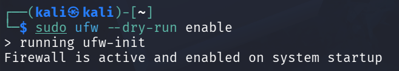
- **Verify with an External Port Scan:** After applying your rules, use a tool like <code>nmap</code> from an external machine to confirm the server’s state. This check verifies that ports you intend to be open are accessible and ports you intend to be closed are not.
  - This command checks the state of ports 22, 80, and 443 from an external machine
    - <code>nmap -p 22,80,443 your_server_ip</code>

The output should show <code>open</code> for allowed ports and <code>closed</code> or <code>filtered</code> for blocked ports, matching your expectations.
