# UFW-Firewall-Configuration
- if UFW already installed jump to [Content](https://github.com/thechiragvaishnav-dotcom/UFW-Firewall-Configuration/blob/main/README.md#content)
- open your linux terminal
  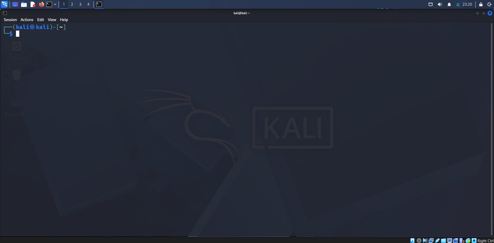
- Check whether UFW is already install or not
  - <code>sudo ufw status</code>

  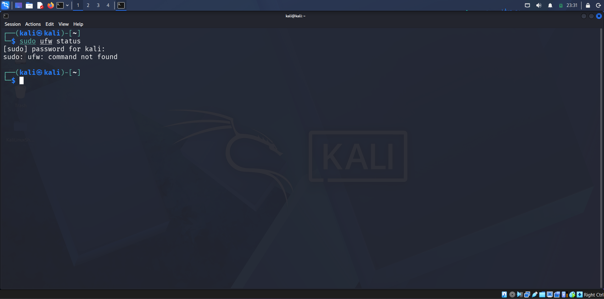
- If you see command not found
  - <code>sudo apt install ufw</code>

  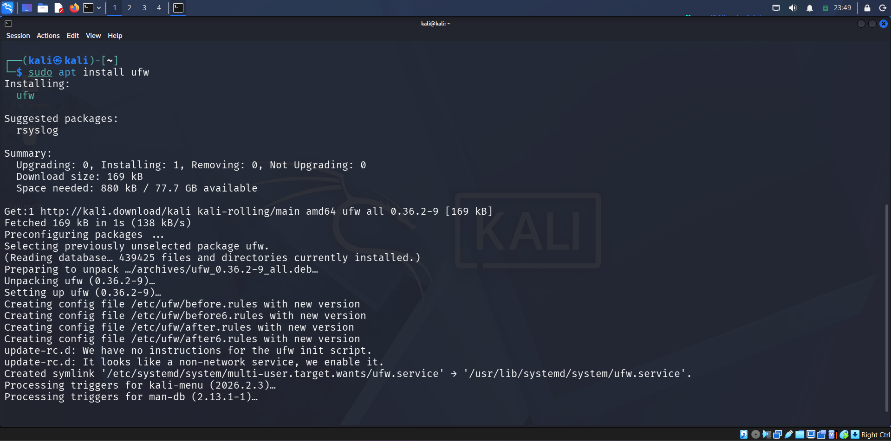

## Content
- [Step 1 — Making Sure IPv6 is Enabled](https://github.com/thechiragvaishnav-dotcom/UFW-Firewall-Configuration/blob/main/README.md#step-1--making-sure-ipv6-is-enabled)
- [Step 2 — Setting Up Default Policies](https://github.com/thechiragvaishnav-dotcom/UFW-Firewall-Configuration/blob/main/README.md#step-2--setting-up-default-policies)
- [Step 3 — Allowing SSH Connections](https://github.com/thechiragvaishnav-dotcom/UFW-Firewall-Configuration/blob/main/README.md#step-3--allowing-ssh-connections)
- [Step 4 — Enabling UFW](https://github.com/thechiragvaishnav-dotcom/UFW-Firewall-Configuration/blob/main/README.md#step-4--enabling-ufw)

## Step 1 — Making Sure IPv6 is Enabled
In recent versions of Ubuntu, IPv6 is enabled by default. In practice that means most firewall rules added to the server will include both an IPv4 and an IPv6 version, the latter identified by <code>v6</code> within the output of UFW’s status command. To make sure IPv6 is enabled, you can check your UFW configuration file at <code>/etc/default/ufw</code>. Open this file using <code>nano</code> or your favorite command line editor:
- <code>sudo nano /etc/default/ufw</code> and press <code>Enter</code>

  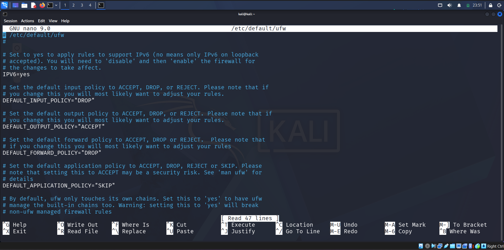
- Then make sure the value of <code>IPV6</code> is set to <code>yes</code>. It should look like this:

  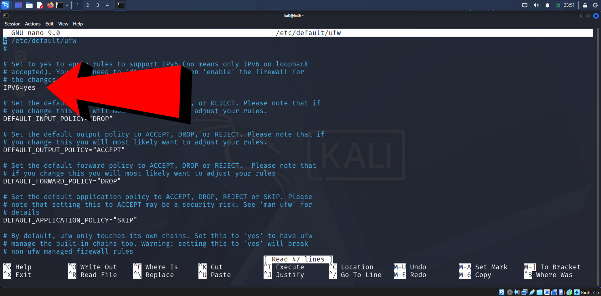
  - Save and close the file. If you’re using <code>nano</code>, you can do that by typing <code>CTRL+X</code>, then <code>Y</code> and <code>ENTER</code> to confirm.
  - When UFW is enabled in a later step of this guide, it will be configured to write both IPv4 and IPv6 firewall rules.

## [Back to Content](https://github.com/thechiragvaishnav-dotcom/UFW-Firewall-Configuration/blob/main/README.md#content)

## Step 2 — Setting Up Default Policies
If you’re just getting started with UFW, a good first step is to check your default firewall policies. These rules control how to handle traffic that does not explicitly match any other rules.

By default, UFW is set to deny all incoming connections and allow all outgoing connections. This means anyone trying to reach your server would not be able to connect, while any application within the server would be able to reach the outside world. You can then create specific <code>allow</code> rules as exceptions to this <code>deny</code> policy.

To make sure you’ll be able to follow along with the rest of this tutorial, you’ll now set up your UFW default policies for incoming and outgoing traffic.

To set the default UFW incoming policy to <code>deny</code>, run:
- <code>sudo ufw default deny incoming</code>

  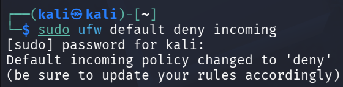

To set the default UFW outgoing policy to allow, run:
- <code>sudo ufw default allow outgoing</code>

  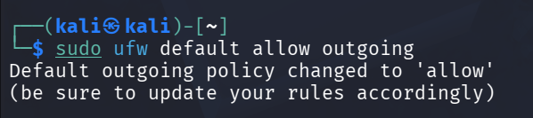

These commands set the defaults to deny incoming and allow outgoing connections. These firewall defaults alone might suffice for a personal computer, but servers typically
need to respond to incoming requests from outside users. We’ll look into that next.

## [Back to Content](https://github.com/thechiragvaishnav-dotcom/UFW-Firewall-Configuration/blob/main/README.md#content)

## Step 3 — Allowing SSH Connections
If you were to enable your UFW firewall now, it would deny all incoming connections. This means that you’ll need to create rules that explicitly allow legitimate incoming connections — SSH or HTTP connections, for example — if you want your server to respond to those types of requests. If you’re using a cloud server, you will probably want to allow incoming SSH connections so you can connect to and manage your server.

1. Allowing the OpenSSH UFW Application Profile\
Upon installation, most applications that rely on network connections will register an application profile within UFW, which enables users to quickly allow or deny external  access to a service. You can check which profiles are currently registered in UFW with:\
<code>sudo ufw app list</code>\
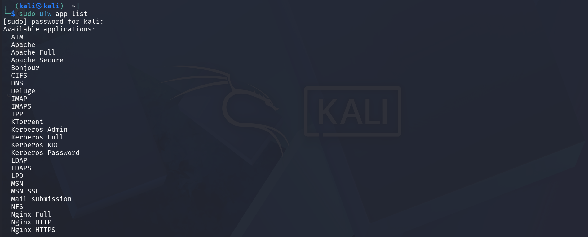\
To enable the OpenSSH application profile, run:\
<code>sudo ufw allow OpenSSH</code>\
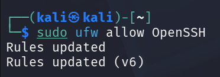\
This will create firewall rules to allow all connections on port 22, which is the port that the SSH daemon listens on by default.

- Allowing SSH by Service Name

Another way to configure UFW to allow incoming SSH connections is by referencing its service name: <code>ssh</code>.
- <code>sudo ufw allow ssh</code>

  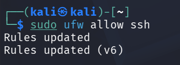

UFW knows which ports and protocols a service uses based on the <code>/etc/services</code> file.

- Allowing SSH by Port Number

Alternatively, you can write the equivalent rule by specifying the port instead of the application profile or service name. For example, this command works the same as the previous examples:
- <code>sudo ufw allow 22</code>

  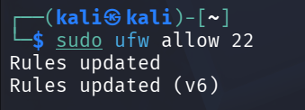

If you configured your SSH daemon to use a different port, you will have to specify the appropriate port. For example, if your SSH server is listening on port <code>2222</code>, you can use this command to allow connections on that port:
- <code>sudo ufw allow 2222</code>

  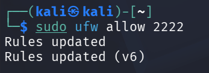

Now that your firewall is configured to allow incoming SSH connections, you can enable it.

- Rate Limiting

To protect services like SSH from automated brute-force attacks, UFW includes a rate-limiting feature. When you apply a rate limit to a service, UFW tracks the frequency of connection attempts from each source IP address. If an IP address makes too many connections in a short period, UFW will temporarily block it. This is a more intelligent approach than simply allowing or denying traffic, as it distinguishes between normal use and behavior that is likely malicious.

To enable rate limiting for a service, you use the <code>limit</code> command instead of <code>allow</code>. The most common use case is securing SSH.
- <code>sudo ufw limit ssh</code>

  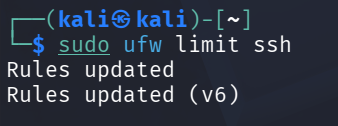

This single command creates a rule that allows SSH connections, but with a condition: if an IP address attempts to initiate six or more connections within 30 seconds, UFW will deny further connections from that IP. It’s a simple and effective way to add an extra layer of security to services exposed to the internet.

## [Back to Content](https://github.com/thechiragvaishnav-dotcom/UFW-Firewall-Configuration/blob/main/README.md#content)

## Step 4 — Enabling UFW
